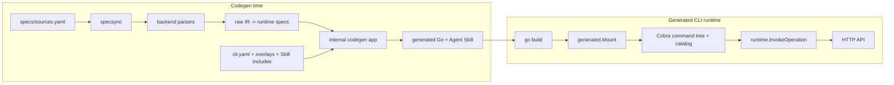
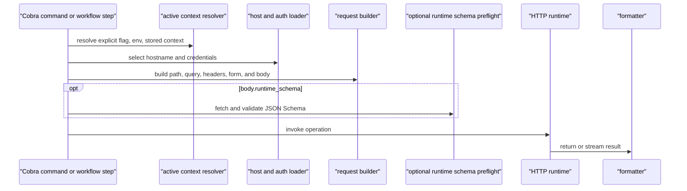

# Architecture

This document owns Lathe's system boundaries, package responsibilities, and
invariants. Configuration and command usage belong in [CLI usage](cli-usage.md);
serialized compatibility belongs in [Machine contracts](contracts.md).

## System Model

Lathe has a codegen phase and a runtime phase. The generated Go packages are the
compile-time seam between them.



Codegen reads API specs and project configuration. Runtime executes only
compiled declarations; it never reads raw specs, overlays, or sync cache state.

## Codegen Pipeline

1. `internal/sourceconfig` loads `specs/sources.yaml`.
2. `internal/specsync` checks out immutable Git inputs or stages an explicit
   `local_path`, then records `sync-state.yaml`.
3. One backend under `internal/codegen/backends/` parses Swagger 2.0, OpenAPI 3,
   protobuf with `google.api.http`, or policy-curated GraphQL into
   `rawir.RawModule`.
4. `internal/codegen/normalize` projects backend facts into
   `[]runtime.CommandSpec`.
5. `internal/overlay` applies supported codegen-time overrides.
6. `internal/lathecmd` collects modules, workflows, and optional Skill output in
   `internal/codegen/app.App`, validates the composition, then renders owned
   outputs.

The main generated outputs are:

```text
internal/generated/<module>/<module>_gen.go
internal/generated/workflows/workflows_gen.go   # when workflows exist
internal/generated/modules_gen.go
internal/generated/skillbundle/                 # when skill.bundle is enabled
<skill.root>/<cli-name>/                         # when Skill generation is enabled
```

`<module>_gen.go` contains compiled API operation specs. `workflows_gen.go`
contains compiled workflow specs. `modules_gen.go` exposes `generated.Mount`,
which mounts API modules, workflows, then bundled capabilities in a stable
order. `generated.MountModules` remains a compatibility alias.

## Package Ownership

| Package | Phase | Responsibility |
|---|---|---|
| `cmd/lathe` | codegen | Generator executable entrypoint for `init`, `skill`, `specsync`, `codegen`, `bootstrap`, and `version`. |
| `internal/lathecmd` | codegen | Command routing and orchestration; resolves flags, builds the generated app, and owns workflow normalization. |
| `internal/sourceconfig` | codegen | Validates Git and local spec source declarations. |
| `internal/specsync` | codegen | Stages source files and validates sync state. |
| `internal/codegen/backends/*` | codegen | Converts one supported spec format into raw IR. |
| `internal/codegen/rawir` | codegen | Backend-neutral facts needed before runtime normalization. |
| `internal/codegen/normalize` | codegen | Produces deterministic runtime operation specs. |
| `internal/overlay` | codegen | Parses supported command, group, parameter, context, body, and output overrides. |
| `internal/codegen/app` | codegen | Collects and validates modules, workflows, and Skill capabilities before writing output. |
| `internal/codegen/render` | codegen | Renders generated Go and Agent Skill files. |
| `internal/projectinit` | codegen | Implements the `lathe init` starter contract and Git postconditions. |
| `internal/latheskill` | distribution | Embeds Lathe's own Agent Skill. |
| `pkg/config` | runtime | Loads the embedded manifest and persists per-host credentials and active contexts. |
| `pkg/runtime` | runtime | Builds operation/workflow commands, catalog data, requests, auth, body handling, pagination, streaming, polling, output, and stable errors. |
| `internal/auth` | runtime | Implements `auth login`, `logout`, `status`, `host default`, and context commands. |
| `pkg/lathe` | runtime | Provides the generated-CLI entrypoint, framework commands, version/update support, and `__lathe verify`. |

`internal/**` is implementation-only. `pkg/**` is linked by downstream generated
CLIs and is therefore a compatibility-sensitive surface.

## Runtime Request Path

Generated API commands and workflow steps share `runtime.InvokeOperation`.



An operation `dry_run.mode=http_preview` resolves the request without network
access and skips runtime-schema fetching. The preview flag is `dry_run.flag`
from `commands show` (usually `--dry-run`). Normal execution can paginate, poll long-running operations, collect
configured streams, and persist a declared active context only after a
successful completed operation.

## Capability Composition

Lathe composes first-party capabilities at generation time; it does not load
runtime plugins.

- `skill.bundle: true` embeds the generated Skill, pins Kitup dependencies, and
  mounts `<cli> skill install`.
- `workflow.commands` renders workflow specs and mounts them as normal root
  commands.
- `catalog.cli.capabilities` records compiled capabilities such as
  `skill.bundle` and `workflow.dsl`.
- `__lathe verify --json` adds capability-specific checks when those features
  are present.

There is no public generated-app ABI, remote extension loader, or third-party
codegen hook. External Go code can still be linked by a downstream application,
but it is outside Lathe's generated capability contract.

## Invariants

1. `pkg/runtime` does not import `internal/codegen/**`.
2. Git sources require an immutable `pinned_tag`; `local_path` sources
   intentionally follow the referenced working tree. The two modes cannot be
   mixed within one source entry, but one manifest may contain entries of both
   kinds.
3. `sync-state.yaml` must match the declared source mode, pinned ref, or resolved
   local path before codegen proceeds.
4. Backends converge on one raw IR and one runtime operation model. Backend
   details do not branch the runtime.
5. Overlays are merged at codegen time. Runtime packages do not know overlay
   syntax or file locations.
6. Generated output is static Go and Skill data. Building or running a generated
   CLI does not invoke codegen or require spec tooling.
7. Host selection is per invocation by default. A user may explicitly elect a
   persisted default host; when elected, it is always visible together with its
   resolution source and always overridable per invocation. Active account
   contexts are stored under a selected host.
8. API commands, workflow steps, catalog entries, generated Skills, and verify
   checks must describe the same compiled command surface.
9. Generated files are outputs. Change specs, `cli.yaml`, or overlays, then
   regenerate instead of editing generated code.

## Related Contracts

- [CLI usage](cli-usage.md)
- [Machine contracts](contracts.md)
- [Workflow commands](workflow.md)
- [Application initializer](lathe-init-design.md)
