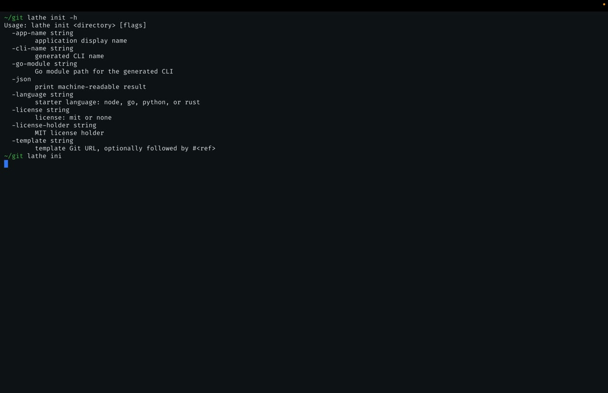
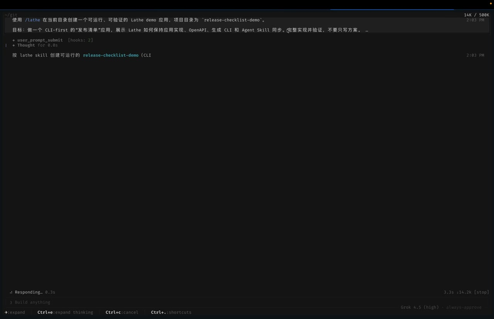
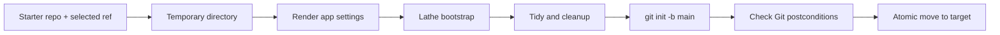

# Lathe application initializer design

Status: implemented; cross-repository gate automation pending
Scope: v1 behavior merged in [PR #96](https://github.com/lathe-cli/lathe/pull/96)

| `lathe init` CLI | Agent-driven application build |
| :---: | :---: |
| [](https://ai-native-app-development.pages.dev/videos/output-2.mp4) | [](https://ai-native-app-development.pages.dev/videos/output-3.mp4) |

Click any preview to play the video.

## 1. Decision

Add one root command:

```text
lathe init [directory]
```

It creates a local, CLI-first application repository from a Lathe-owned starter template. The v1 catalog contains:

- `node`
- `go`
- `python`
- `rust`

The initialized repository has these postconditions:

- the target is a new Git repository on branch `main`;
- it has no commit;
- all application files are untracked, with nothing staged;
- it has no Git remote;
- its OpenAPI contract, generated Go CLI, embedded `cli.yaml`, and generated CLI Skill are already synchronized;
- it is ready for application development and template-specific checks.

The command creates a local repository only. It does not create a GitHub repository, configure `origin`, stage files, or commit.

Version 1 supports `MIT` and `none` as license choices.

## 2. Product contract

The feature is not a generic project scaffolding engine. It is a narrow entry point into Lathe's CLI-first application workflow:



The contract sources of truth remain:

- `openapi/openapi.yaml` for the application API;
- root `cli.yaml` for generated CLI behavior;
- the template manifest and resolved Git commit for one initialization run.

The application implementation must change together with its OpenAPI contract, but it does not override the public API contract.

`internal/generated/**`, `skills/<cli-name>/**`, and `cmd/<cli-name>/cli.yaml` remain generated outputs. The initializer must regenerate them, never patch them as source files.

## 3. Command UX

### Interactive

```text
$ lathe init
Target directory [my-app]: acme
Select language:
  1) Node.js
  2) Go
  3) Python
  4) Rust
Language [1]: 4
Application name [acme]: Acme
CLI name [acmectl]:
Go module [example.com/acme]:
License [mit]:
License holder [Acme contributors]: Acme, Inc.

Created /absolute/path/acme
Next: cd /absolute/path/acme && make check
```

The target directory may be omitted only in an interactive terminal. Language is selected from the numbered menu. Other missing values are prompted when stdin and stderr are terminals.

### Non-interactive and agent use

```bash
lathe init ./acme \
  --language rust \
  --app-name Acme \
  --cli-name acmectl \
  --license mit \
  --license-holder 'Acme, Inc.' \
  --json
```

Flags:

| Flag | Contract |
| --- | --- |
| `--language node|go|python|rust` | Required outside a terminal. |
| `--template <git-url>[#<ref>]` | Overrides the built-in repository; optional fragment selects a branch or tag. |
| `--app-name <name>` | Display name. Defaults to the target directory basename. |
| `--cli-name <name>` | Generated executable name. Defaults to `<app-slug>ctl`. |
| `--license mit|none` | Defaults to `mit`. |
| `--license-holder <text>` | Defaults to `<app-name> contributors` when MIT is selected. |
| `--go-module <path>` | Go module used by the generated CLI. Defaults to `example.com/<app-slug>` and is shown as a prompt in interactive mode. |
| `--json` | Emits one stable machine-readable result on stdout. Prompts and progress stay on stderr. |

The target directory basename is the application slug. It must be lowercase ASCII kebab-case: `[a-z0-9][a-z0-9-]*`. Version 1 does not add language-specific package-name prompts. Each template derives its package name from this slug using its documented convention.

If execution is non-interactive and a required value is missing, the command fails with the exact missing flag. It must never wait on a prompt in an agent or CI process.

Example JSON result:

```json
{
  "schema_version": 1,
  "path": "/absolute/path/acme",
  "language": "rust",
  "app_name": "Acme",
  "cli_name": "acmectl",
  "license": "mit",
  "template": {
    "repo": "https://github.com/lathe-cli/lathe-rust-starter.git",
    "ref": "main",
    "commit": "0123456789abcdef0123456789abcdef01234567"
  },
  "git": {
    "branch": "main",
    "has_commits": false,
    "has_remote": false,
    "staged_files": 0
  },
  "next_command": "make check"
}
```

## 4. Template delivery

Use the existing public starter repositories as canonical templates:

| Language | Repository |
| --- | --- |
| Node.js | `lathe-cli/lathe-node-starter` |
| Go | `lathe-cli/lathe-go-starter` |
| Python | `lathe-cli/lathe-python-starter` |
| Rust | `lathe-cli/lathe-rust-starter` |

Lathe contains a small internal catalog mapping language to its default Git URL and supported template manifest schema version.

By default, initialization fetches the latest `main` from that repository. Users may override the repository, branch, or tag:

```bash
lathe init ./acme --language node
lathe init ./acme --language node \
  --template https://github.com/acme/lathe-node-template.git#next
lathe init ./acme --language node \
  --template https://github.com/acme/lathe-node-template.git#v1.2.0
```

This `#ref` form is Lathe syntax, not native `git clone` URL behavior. Lathe splits the fragment, then passes the ref to `git clone --branch`; Git accepts either a branch or tag there. If the fragment is absent, Lathe explicitly uses `main`. The resolved 40-character commit is verified and returned in text/JSON output so one initialization can still be audited, but Lathe does not pin it for future runs.

A custom repository must contain a valid `.lathe-template.yaml`, and its declared language must match `--language`. Arbitrary repositories without the Lathe template contract are rejected.

Version 1 fetches templates through `git` and normalizes the generated CLI module through `go`, so it requires network access plus working Git and Go executables. It does not use `gh`, GitHub's “generate from template” API, an online registry, or an offline bundled template archive.

Because every default points at a moving `main`, compatibility is a cross-repository invariant:

- every starter change must run the current released Lathe, or the candidate Lathe during the initial rollout, against the candidate branch before merging;
- every Lathe initializer or manifest-schema change must run the candidate Lathe against all four current starter `main` branches;
- a catalog entry is supported only while its current `main` contains a compatible `.lathe-template.yaml` and passes its declared check profile;
- a Lathe release must not advertise a language whose current starter `main` fails that gate.

This two-sided gate is required continuously, not only when Lathe itself is released. It prevents a starter merge from breaking an already released initializer.

## 5. Template manifest

Each starter repository adds `.lathe-template.yaml` as a declarative, reviewable contract. It contains no hooks and cannot execute commands.

Schema-shaped example:

```yaml
schema_version: 1
language: go
defaults:
  app_name: CLI-first Go app
  app_slug: cli-first-go-app
  cli_name: appctl
  go_module: example.com/cli-first-go-app
  lathe_version: v0.4.4
replacements:
  - variable: app_name
    files: [README.md]
  - variable: cli_name
    files: [README.md, cli.yaml, cmd/appctl/cli.yaml]
  - variable: go_module
    files: [go.mod, cmd/appctl/main.go]
  - variable: lathe_version
    files: [go.mod, Makefile]
renames:
  - from: cmd/appctl
    variable: cli_name
generated: [internal/generated, skills/appctl]
cleanup: [.cache, bin]
check_profile: make
```

Each replacement selects a value by `variable`. Its source token is `from` when present, otherwise `defaults[variable]`. The actual manifest lists every editable text file. Rendering is exact replacement in those allowlisted files; it is not repository-wide templating and does not interpret source code.

Rules:

- all listed paths must resolve inside the template root;
- symlinks are rejected;
- binary files cannot be replacement targets;
- each expected default token must be found, otherwise initialization fails;
- renames happen before generated output is rebuilt;
- old generated directories are removed only inside the temporary working tree;
- `check_profile` is an enum resolved to Lathe-owned commands; no shell command comes from the manifest.

This preserves direct clone/fork usability: each starter remains a valid example with real defaults rather than placeholder tokens.

## 6. Initialization pipeline

`lathe init` executes these steps:

1. Parse and validate every input, including the running Lathe version, before network access.
2. Refuse the operation if the target path already exists. Version 1 has no `--force` and never merges into an existing directory.
3. Create a temporary sibling directory under the target parent.
4. Split the optional `#ref`, then clone the selected repository using `main` or that ref.
5. Resolve and validate the cloned commit SHA.
6. Remove the template's `.git` directory and reject symlinks in the temporary tree.
7. Load the manifest and validate its schema version and declared language.
8. Apply allowlisted replacements and path renames, remove declared generated outputs, and write or remove `LICENSE`.
9. Run the current Lathe executable's `bootstrap` command with the temporary project as its working directory.
10. Run `go mod tidy` after bootstrap.
11. Remove manifest-declared build/cache paths and `.lathe-template.yaml`.
12. Run `git init -b main`.
13. Assert: no commits, no staged entries, no remotes, and at least one untracked application file exists.
14. Atomically rename the completed temporary directory to the target.

If any step fails, remove the temporary directory and leave the requested target absent. Do not leave a half-created repository.

The command runs Lathe generation and repository postcondition checks, but it does not scan for undeclared old template identifiers or run the full Node/Go/Python/Rust application test suite. Full checks may need language toolchains and can be expensive. The result prints the Lathe-owned check command selected by the manifest's enum.

## 7. Project-root execution

Current bootstrap behavior is coupled to the process working directory: it reads `go.mod`, `cli.yaml`, spec sources, cache, and output paths relative to cwd.

Do not implement init with process-global `os.Chdir`. Version 1 reuses the current Lathe executable and sets `exec.Cmd.Dir` to the temporary repository:

```text
lathe init -> current executable bootstrap, Cmd.Dir = temporaryRoot
```

This reuses the existing cwd contract without global process mutation or a broad output-root refactor. Add an in-process explicit-root API only if a measured startup or orchestration need appears later.

## 8. Package ownership

Recommended ownership:

| Path | Responsibility |
| --- | --- |
| `internal/lathecmd/init.go` | Flags, prompts, JSON/text output, exit behavior. |
| `internal/projectinit/` | Template catalog, fetch, manifest validation, rendering, materialization, Git postconditions. |
| existing bootstrap/codegen packages | Unchanged generation behavior; no knowledge of starter templates. |
| `internal/latheskill/` | Static Lathe Skill source and embedded files. |
| `internal/lathecmd/skill.go` | `lathe skill install` command. |

Do not put starter initialization into `internal/specsync`: that package owns API specification sources, not complete application repositories. A small internal Git helper can be extracted if both need the exact same clone-and-verify behavior.

## 9. Lathe's own Skill

Generated application Skills under `skills/<cli-name>/` describe a generated application CLI and are rewritten by code generation. They are the wrong owner for Lathe's own workflow.

Lathe adds one product-owned static Skill, embedded in the release binary. It documents the agent-safe loop:

1. choose a supported language;
2. call `lathe init` non-interactively with explicit flags;
3. inspect the JSON result;
4. enter the new repository;
5. read its `AGENTS.md`;
6. make application and OpenAPI changes together;
7. regenerate the CLI;
8. use the generated CLI as the main acceptance surface.

Expose it through:

```text
lathe skill install
```

The installer uses the same Kitup core mechanism as generated CLIs, but does not introduce Cobra into Lathe's stdlib-flag command router. The Skill is static source under `internal/latheskill/`, not generated output under top-level `skills/`.

This keeps the standalone release binary self-contained. Merely adding loose Skill files to release archives would not cover Homebrew or other single-binary installation paths.

## 10. Lathe/runtime version invariant

Bootstrap output and the target Go runtime dependency must stay compatible. An initializer must not combine a new code generator with an arbitrary old `github.com/lathe-cli/lathe` dependency from a starter.

Release behavior:

- a released Lathe binary rewrites the target's Lathe module requirement to its own exact semantic version;
- a development binary first accepts an explicit `LATHE_INIT_VERSION`, otherwise reads its Go main-module version from `debug.ReadBuildInfo`, strips a trailing `+dirty`, and uses that version when available;
- if neither linked release version, development override, nor usable build-module version exists, initialization fails before cloning;
- it runs the controlled module tidy step after bootstrap;
- it never writes a machine-local `replace` directive into the user's repository;
- candidate releases must be proven against every default template's current `main` using a temporary external Go workspace; no `replace` directive may be written into the result repository.

If the running binary has no usable linked version, development override, or Go build-module version, initialization fails clearly instead of producing a repository with uncertain generator/runtime compatibility.

## 11. Verification

### Fast local tests

Use temporary local Git repositories as template fixtures. Unit and integration tests must not depend on GitHub.

Current tests cover the local template/ref flow, replacements, renames, license generation, Git postconditions, strict manifest fields, non-interactive language errors, target prompting, numbered language selection, and development build-module version resolution.

Remaining required cases:

- existing target is rejected without modification;
- invalid slug, CLI name, module path, manifest path, and symlink fail closed;
- all supported replacement variables and multi-file replacements are exercised;
- generated paths are rebuilt and no old `appctl` or default module residue remains;
- failed initialization leaves the target absent;
- default `main` and custom branch resolution behave as declared; custom tag resolution is already covered;
- JSON output matches schema version 1;
- the embedded Lathe Skill contains the current flags and command loop.

### Cross-repository release gate

For every catalog entry:

1. fetch the current `main` and record its resolved commit;
2. run non-interactive `lathe init`;
3. run the Lathe-owned command selected by the starter's check profile;
4. verify generation is clean;
5. verify the generated CLI handles success and contract-defined error paths.

This lane is allowed network access and installs the relevant language toolchain. It is not part of the fast unit-test loop.

The Lathe repository does not yet automate this lane. Until it does, starter maintainers must run the same check before merging changes to a default template `main`.

## 12. Deliberate exclusions

Version 1 does not include:

- GitHub repository creation or `origin` setup;
- commits, staging, pushing, or pull requests;
- plugins, arbitrary hooks, or manifest-provided commands;
- an online template registry;
- offline template bundles or caches;
- template upgrading after initialization;
- a license catalog beyond `mit|none`;
- framework, database, deployment, or authentication choices;
- `--force` or initialization into a non-empty directory.

These exclusions keep the first release reversible, reproducible, and owned by Lathe's existing spec-to-CLI product boundary.

## 13. Remaining rollout work

The command, project initializer, interactive UX, JSON result, embedded Skill, Skill installer, and schema-v1 manifests on all four starter `main` branches are implemented. The remaining v1 hardening work is:

1. automate the cross-repository gate above;
2. close the remaining local-test gaps without adding GitHub-dependent tests to the fast suite.

Template registries, remote repository creation, and update workflows remain separate features requiring separate evidence and design.
