# `lathe init` Architecture

This document owns the implementation contract and safety boundaries of
`lathe init`. Command usage belongs in [CLI Usage](cli-usage.md); release
validation belongs in the repository's Lathe release Skill.

## Product boundary

`lathe init <directory>` creates a local CLI-first application repository from
a Lathe starter. It is not a generic scaffolder or a repository-hosting client.

Supported starter languages are `node`, `go`, `python`, and `rust`.
Supported licenses are `mit` and `none`.

A successful target:

- is a new Git repository on `main`;
- has application files, but no commit or staged files;
- has no remote;
- contains a synchronized OpenAPI contract, generated Go CLI, and generated
  CLI Skill;
- reports the starter repository, requested ref, resolved commit, and the check
  command Lathe maps from the starter's declared check profile.

`lathe init` never creates a GitHub repository, configures `origin`, stages,
commits, pushes, or opens a pull request.

## Pipeline

```mermaid
flowchart LR
    A["Resolve inputs and Lathe version"] --> B["Clone starter into sibling temp directory"]
    B --> C["Validate manifest and reject symlinks"]
    C --> D["Render allowlisted replacements and renames"]
    D --> E["Remove declared generated paths"]
    E --> F["Bootstrap CLI and tidy Go module"]
    F --> G["Clean template metadata"]
    G --> H["git init -b main and verify postconditions"]
    H --> I["Rename temp directory to target"]
```

The target must not already exist. Work happens in a temporary directory under
the target's parent, so a failure removes the temporary tree and leaves the
target absent. The final rename exposes only a completed project.

## Starter contract

Default templates are public repositories owned by `lathe-cli`:

| Language | Repository |
| --- | --- |
| Node.js | `lathe-node-starter` |
| Go | `lathe-go-starter` |
| Python | `lathe-python-starter` |
| Rust | `lathe-rust-starter` |

The internal language catalog maps each language to its default Git URL. The
template schema version is validated separately by
`internal/projectinit.loadManifest`.

With no override, Lathe clones `main`. A custom source uses
`<git-url>#<branch-or-tag>`; Lathe passes the selected ref to Git and records
the resolved 40-character commit. This records one run but does not pin future
default-template runs.

Every starter must contain a strict `.lathe-template.yaml` with:

- schema version and language;
- default replacement values;
- an allowlist of text replacements and renames;
- generated paths to remove before bootstrap;
- cleanup paths;
- a supported check profile.

Unknown manifest fields, mismatched languages, invalid local paths, binary
replacement targets, missing replacement tokens, and any symlink fail closed.
Manifest commands and arbitrary hooks are not supported.

## File ownership

After initialization:

- `openapi/openapi.yaml` is the application API contract.
- root `cli.yaml` is the generated CLI configuration.
- `internal/generated/**` and `skills/<cli-name>/**` are bootstrap outputs.
- `cmd/<cli-name>/cli.yaml` is an embedded config copy managed by the starter's
  declared replacement/check workflow.

The initializer applies only manifest-allowlisted text replacements. In
particular, it may update and rename `cmd/<cli-name>/cli.yaml`; it does not
pretend that file was regenerated by the codegen writer. Bootstrap removes and
rebuilds only paths declared as generated by the template.

The initialized repository's own instructions decide which generated outputs
are committed. Lathe's repository policy against committing
`internal/generated/**` applies only to this repository.

## Generator/runtime version handling

Lathe resolves its generator version before cloning:

- release binaries use their linked semantic version;
- development binaries accept `LATHE_INIT_VERSION`, otherwise use the Go main
  module version when available;
- if no usable version can be resolved, initialization stops before cloning;
- no machine-local `replace` directive is written into the target.

The default starters declare a `lathe_version` replacement so their generated
CLI depends on that resolved version. A custom template must declare the same
replacement if it wants this invariant; Lathe validates its manifest but does
not inspect the final `go.mod` for version equality.

## Runtime and output requirements

Initialization requires working `git` and `go` executables plus network
access to the starter. It does not require `gh` or the GitHub API.

`--json` emits a schema-versioned result on stdout. Prompts and progress use
stderr. Non-interactive runs require an explicit directory and language and
never wait for input.

## Verification ownership

Package tests use local Git fixtures for input validation, manifest rendering,
path safety, version resolution, and Git postconditions. Release candidates
must additionally initialize all four default starters and run each returned
check command. That cross-repository gate is captured in
`.agents/skills/lathe-release/SKILL.md`; it is not duplicated here.

## Deliberate exclusions

There is no `--force`, initialization into a non-empty directory, template
registry, offline bundle, upgrade workflow, plugin hook, framework/database
selector, or remote repository mutation.
